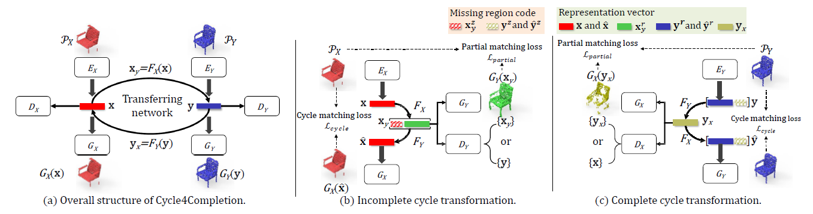

# Cycle4Completion

This repository contains the source code for the paper [Cycle4Completion: Unpaired Point Cloud Completion using Cycle Transformation with Missing Region Coding](https://arxiv.org/abs/2103.07838).
[](c4c.png)

## Cite this work

```
@inproceedings{wen2021c4c,
  title={Cycle4Completion: Unpaired Point Cloud Completion using Cycle Transformation with Missing Region Coding},
  author={Wen, Xin and Han, Zhizhong and Cao, Yan-Pei and Wan, Pengfei and Zheng, Wen and Liu, Yu-Shen},
  booktitle={Proceedings of the IEEE Conference on Computer Vision and Pattern Recognition (CVPR)},
  year={2021}
}
```

## Datasets

Preprocessed 3D-EPN dataset can be downloaded from:
https://drive.google.com/file/d/1TxM8ZhaKEZWWSnakU2KGBLAO0pRnKDKo/view?usp=sharing

## Requirements
Python 2.7 
Tensorflow 1.14.0
For detailed implementation, please follow PointNet++ on this page：
https://github.com/charlesq34/pointnet2

## Getting Started
1. Unzip the downloaded dataset file "dataset.rar" to the "dataset" folder. 

2. To train Cycle4Completion, you can simply use the following command:

```
python main.py
```

## License

This project is open sourced under MIT license.
